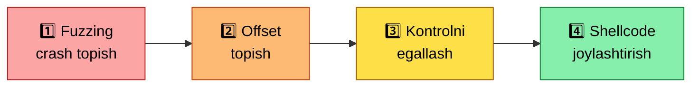

<div align="center">

# 🟠 04 — Binary Exploitation (Pwn)


*Dasturlar xotirasi darajasida hujum qilish san'ati*

</div>

> ⭐ Bu — loyihaning eng chuqur qatlamlaridan biri. Bu yerda siz dastur ishga tushganda xotirada nima bo'layotganini, va ana shu xotirani qanday manipulyatsiya qilib, dastur bajarilish oqimini o'z nazoratingizga olishni o'rganasiz.

⚠️ **Oldingi shart:** C tilini (pointer, xotira modeli) va asosiy Linux CLI ko'nikmalarini yaxshi bilishingiz **shart**. [`06-arm64-asm`](../06-arm64-asm/README.md) bilan parallel o'tilishi tavsiya etiladi.

---

## 1️⃣ 🧬 ELF format va statik tahlil

<details open>
<summary><b>📐 ELF tuzilishi</b></summary>
<br>

- ELF header, Program header (segmentlar), Section header (bo'limlar)
- Muhim segmentlar: `.text` (kod), `.data`/`.bss` (o'zgaruvchilar), `.rodata` (o'zgarmas ma'lumot)

</details>

<details open>
<summary><b>🔧 Asosiy tahlil vositalari</b></summary>
<br>

| Tool | Vazifasi |
|---|---|
| `file` | Binary turi va arxitekturasini aniqlash |
| `readelf -h/-S/-l` | Header, section, segment ma'lumotlari |
| `objdump -d` | Disassembly — kodni assembly ko'rinishida ko'rish |
| `strings` | Binary ichidagi o'qiladigan matnlarni topish |
| **`checksec`** | Himoya mexanizmlarini tekshirish ⚡ *hal qiluvchi ahamiyatga ega* |

</details>

---

## 2️⃣ 🐞 Debugging — GDB va GEF

<details open>
<summary><b>⌨️ GDB asoslari</b></summary>
<br>

- Breakpoint qo'yish: `break *addr`, `break func_name`
- Qadam-baqadam bajarish: `stepi`/`si`, `nexti`/`ni`, `continue`
- Registrlarni (`info registers`) va xotirani (`x/10xg $sp`) ko'rish

</details>

<details open>
<summary><b>🎨 GEF (GDB Enhanced Features)</b></summary>
<br>

- GEF GDB'ni vizual va qulay qiladi: stack, registrlar, disassembly bir ekranda
- `-x init.gdb` skripti bilan avtomatik breakpoint (masalan, `_start`da) qo'yib debugging boshlash — bu ARM64'da statik binary'larni tahlil qilishda juda qulay
- Foydali GEF buyruqlari: `checksec`, `vmmap`, `pattern create`/`pattern search`

</details>

---

## 3️⃣ 💥 Stack-based Buffer Overflow — birinchi ekspluatatsiya

> **Nega yuzaga keladi:** `strcpy`, `gets`, `scanf("%s")` kabi funksiyalar buffer chegarasini tekshirmaydi — agar kiritma buferdan katta bo'lsa, u stackdagi qo'shni ma'lumotni (masalan, return address'ni) qayta yozadi.



<details open>
<summary><b>📋 Klassik ekspluatatsiya oqimi</b></summary>
<br>

1. **Fuzzing/crash topish:** dasturga uzun kiritma yuborib, crash qilish
2. **Offset topish:** `pattern create`/`pattern search` orqali return address qaysi baytdan boshlanishini aniqlash
3. **Kontrolni egallash:** return address'ni o'zingiz istagan manzil bilan almashtirish
4. **Shellcode yozish va joylashtirish:** maqsadli kodni stackka joylashtirib, unga sakrash

</details>

<details open>
<summary><b>⚙️ ARM64'da farqlar</b></summary>
<br>

- Return address `x30` (link register, LR) orqali boshqariladi, x86'dagi kabi to'g'ridan-to'g'ri stackda emas — bu offset hisoblashda alohida e'tibor talab qiladi
- Calling convention (AAPCS64) — argumentlar `x0`–`x7` registrlarida uzatiladi

</details>

---

## 4️⃣ 🛡️ Zamonaviy himoya mexanizmlari va ularni yengish

> Zamonaviy tizimlarda oddiy buffer overflow ko'pincha yetarli emas:

| Himoya | Nima qiladi | Yengish strategiyasi |
|---|---|---|
| 🐤 **Stack Canary** | Return address oldiga tasodifiy qiymat qo'yadi | Canary qiymatini sizib chiqarish (leak) yoki chetlab o'tish |
| 🚫 **NX / DEP** | Stack/heap'da kod bajarilishini taqiqlaydi | **ROP** — mavjud kod bo'laklaridan zanjir qurish |
| 🎲 **ASLR** | Xotira manzillarini har ishga tushganda tasodifiylashtiradi | Manzil sizib chiqishi (info leak) orqali aniqlash |
| 📍 **PIE** | Binary'ning o'zini ham tasodifiy manzilga yuklaydi | ASLR bilan bir xil yondashuv + binary bazasini hisoblash |

<details open>
<summary><b>🔗 ROP (Return-Oriented Programming)</b></summary>
<br>

NX yoqilgan bo'lsa, o'z shellcode'ingizni bajara olmaysiz — buning o'rniga binary ichidagi mavjud kod bo'laklarini (**"gadget"**) zanjirlab, kerakli amalni bajarasiz. `ROPgadget` yoki `pwntools`ning ROP moduli — gadget'larni avtomatik topish va zanjir qurish uchun.

</details>

<details open>
<summary><b>📝 Format String zaifliklari</b></summary>
<br>

`printf(user_input)` kabi noto'g'ri chaqiruv — foydalanuvchi `%x`, `%s`, `%n` orqali stack'ni o'qishi yoki hatto yozishi mumkin. Bu orqali xotira manzillarini sizib chiqarish yoki qiymatlarni yozib qo'yish mumkin.

</details>

<details open>
<summary><b>🧱 Heap Exploitation (kirish darajasi)</b></summary>
<br>

- `malloc`/`free` ishlash mexanizmi, heap metadata tuzilishi
- **Use-after-free** — bo'shatilgan xotiraga hali ham ko'rsatkich orqali murojaat qilish
- **Double-free** — bir xotira bo'lagini ikki marta bo'shatish orqali heap metadata'ni buzish

> ⚠️ Bu mavzu juda chuqur — alohida kitob/kurs talab qiladi.

</details>

---

## 5️⃣ 🐍 Pwntools — exploit yozishni avtomatlashtirish

```python
from pwn import *

elf = ELF('./vuln_binary')
p = process('./vuln_binary')  # yoki remote('host', port)

payload = b'A' * offset + p64(target_address)
p.sendline(payload)
p.interactive()
```

| Funksiya/Klass | Vazifasi |
|---|---|
| `p32`/`p64` | Sonlarni to'g'ri byte tartibida (little-endian) pack qilish |
| `ELF`, `ROP` | Binary tahlili va gadget qidirishni avtomatlashtiradi |
| `remote()` | CTF serverlariga masofadan ulanish |

---

## 6️⃣ 🖥️ Emulyatsiya — Unicorn Engine

> Ba'zan real qurilma yoki to'liq OS'siz kod bajarilishini tahlil qilish kerak bo'ladi.

- **Unicorn engine** — CPU emulyatori (ARM, x86, MIPS va h.k.)
- **Foydalanish holatlari:** firmware tahlili, shellcode'ni xavfsiz muhitda sinash, fuzzing uchun tezkor emulyatsiya

---

## 7️⃣ 🧪 Laboratoriyalar

| # | Platforma | Izoh |
|:---:|---|---|
| 1 | **OverTheWire: Narnia** | Buffer overflow'ning eng sodda darajasidan boshlanadi |
| 2 | **pwn.college** | Tizimli, video-ma'ruzali, chuqur pwn kursi (ASU) |
| 3 | **pwnable.kr** | Klassik va mashhur pwn mashqlari to'plami |
| 4 | **HackTheBox / TryHackMe** | Real CTF uslubidagi pwn masalalari |

---

## ✅ Bu bosqichni tugatgach, siz quyidagilarni bilishingiz kerak

- [ ] `checksec` natijasini o'qib, qaysi himoyalar yoqilganini va bu nimani anglatishini tushuntira olasiz
- [ ] GDB/GEF orqali crash'ning aniq sababini (qaysi registr/manzil) topa olasiz
- [ ] Oddiy stack buffer overflow orqali return address'ni boshqara olasiz
- [ ] NX yoqilgan holatda ROP zanjiri qurib, exploit yoza olasiz
- [ ] Format string zaifligi orqali xotiradan ma'lumot sizib chiqara olasiz
- [ ] Pwntools yordamida to'liq avtomatlashtirilgan exploit skripti yoza olasiz

---

## 📚 Resurslar

| Resurs | Izoh |
|---|---|
| *Hacking: The Art of Exploitation* | Binary exploitation'ga eng klassik kirish kitobi |
| **pwn.college** | Bepul, video bilan, ASU tomonidan tizimli pwn kursi |
| **Azeria Labs** | ARM/ARM64 arxitekturasida exploitation bo'yicha eng yaxshi bepul resurs |
| *CS:APP* | Xotira, kompilyatsiya va tizim darajasidagi tushunish uchun |
| **ROP Emporium** | ROP texnikasini bosqichma-bosqich o'rgatuvchi mashqlar |

---

<div align="center">

**◀** [🟡 03-network-pentest](../03-network-pentest/README.md) &nbsp;|&nbsp; **Keyingi qadam →** [🟠 05-reverse-engineering](../05-reverse-engineering/README.md)

</div>

