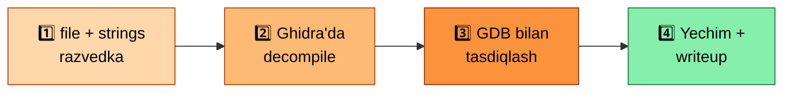

# 🟠 05 — Reverse Engineering

*Kodni manba kodisiz tahlil qilish san'ati*

> Reverse engineering — manba kodi bo'lmagan dasturni tushunish san'ati. Bu ko'nikma malware tahlili, CTF crackme'lari, va hatto legacy tizimlarni tushunishda hal qiluvchi ahamiyatga ega.

⚠️ **Oldingi shart:** [`04-binary-exploitation`](../04-binary-exploitation/README.md) bilan parallel yoki undan keyin o'tish tavsiya etiladi — ikkalasi bir-birini to'ldiradi: exploitation "buzish", reversing esa "tushunish"ga ko'proq urg'u beradi.

---

## 1️⃣ 🔬 Statik tahlil (dastur bajarilmasdan tahlil qilish)

<b>🖥️ Disassembler'lar</b>

 

| Tool | Xususiyati |
|---|---|
| **Ghidra** | NSA tomonidan, bepul, ochiq manba, decompiler funksiyasi bilan assembly'ni C-ga o'xshash kodga aylantiradi |
| **radare2 / rizin** | Terminal-asosli, skriptlashtiriladigan, juda kuchli lekin o'rganish egri chizig'i tikroq |
| **IDA Free** | Sanoat standarti (pullik versiyasi ko'proq imkoniyat beradi) |

<b>🔎 Nima izlash kerak</b>

 

- `main` funksiyasini topish, undan chaqiriladigan funksiyalar grafigini qurish
- Satrlar (strings) — parollar, xato xabarlari, debug ma'lumotlari ko'pincha dastur mantig'iga ishora qiladi
- Import qilingan funksiyalar (`strcmp`, `malloc`, tarmoq funksiyalari) — dastur nima qilishi haqida gipoteza tuzishga yordam beradi

---

## 2️⃣ ⏯️ Dinamik tahlil (dasturni ishga tushirib kuzatish)

- GDB/GEF bilan qadam-baqadam bajarish (`04-binary-exploitation`da o'rgangan ko'nikmalar bu yerda ham ishlatiladi)
- `strace`/`ltrace` — dastur qaysi syscall/kutubxona funksiyalarini chaqirayotganini kuzatish
- Breakpoint qo'yib, muhim taqqoslash (`cmp`) operatsiyalarini topish — bu ko'pincha "to'g'ri parol"ni aniqlash kaliti bo'ladi

---

## 3️⃣ 🕵️ Anti-analysis texnikalarini tanish

> Ba'zi dasturlar (ayniqsa malware yoki murakkab crackme'lar) tahlilni qiyinlashtirish uchun maxsus texnikalardan foydalanadi:

| Texnika | Tavsifi |
|---|---|
| 🚨 **Anti-debugging** | Dastur GDB ilova qilinganini aniqlab, xatti-harakatini o'zgartiradi (`ptrace` tekshiruvi) |
| 🌀 **Obfuskatsiya** | Kodni ataylab murakkablashtirish (keraksiz tarmoqlanishlar, junk instruksiyalar) |
| 📦 **Packing** | Binary'ni siqib/shifrlab, faqat ishga tushganda xotirada "ochish" (masalan, UPX packer) |

> 💡 Bu bosqichda faqat **tanish** darajasida yetarli — chuqur bypass texnikalari Pro darajasida keladi.

---

## 4️⃣ 🎯 Amaliy mashqlar: Crackme'lar

> **Crackme** — ataylab "parolni toping" yoki "seriyani yarating" tarzida yozilgan kichik dasturlar bo'lib, reverse engineering mashqi uchun ideal.

📍 **Platforma:** crackmes.one — turli qiyinlik darajasidagi minglab crackme'lar, community yechimlari bilan.

---

## ✅ Bu bosqichni tugatgach, siz quyidagilarni bilishingiz kerak

- [ ] Ghidra'da binary'ni yuklab, `main` funksiyasidan boshlab mantiqni o'qiy olasiz
- [ ] `strings` va import funksiyalar orqali dastur maqsadi haqida gipoteza tuza olasiz
- [ ] GDB bilan muhim taqqoslash nuqtalarini topib, "to'g'ri kirish"ni aniqlay olasiz
- [ ] Kamida 3–5 ta oddiy/o'rta darajadagi crackme'ni mustaqil yechgan bo'lasiz
- [ ] Anti-debugging va packing nima ekanini, ularni qanday aniqlashni tushuntira olasiz

---

## 📚 Resurslar

| Resurs | Izoh |
|---|---|
| Ghidra rasmiy hujjatlari va video darslari | Eng keng qo'llaniladigan bepul decompiler |
| **crackmes.one** | Amaliy mashq uchun eng katta crackme kutubxonasi |
| *Practical Malware Analysis* | Reverse engineering va malware tahlili bo'yicha klassik kitob |
| radare2 Book | r2 bo'yicha rasmiy, chuqur qo'llanma |

---

**◀** [🟠 04-binary-exploitation](../04-binary-exploitation/README.md) &nbsp;|&nbsp; **Keyingi qadam →** [🟠 06-arm64-asm](../06-arm64-asm/README.md)

