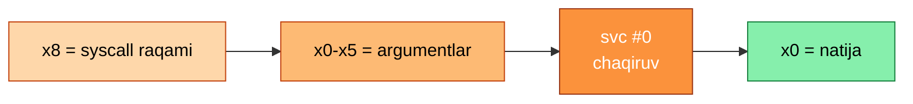

<div align="center">

# 🟠 06 — ARM64 Assembly


*Protsessor darajasida chuqur tushunish*

</div>

> Assembly — protsessor bilan "to'g'ridan-to'g'ri" muloqot tili. Uni bilish sizga yuqori darajadagi tillar (C, Python) yashirgan barcha tafsilotlarni ko'rish imkonini beradi — bu esa [`04-binary-exploitation`](../04-binary-exploitation/README.md) va [`05-reverse-engineering`](../05-reverse-engineering/README.md) bo'limlarida bevosita ishlatiladi.

### 🤔 Nega ARM64?

ARM64 (AArch64) — zamonaviy mobil qurilmalar, Apple Silicon, va tobora ko'proq server/cloud infratuzilmasida (AWS Graviton, Oracle Cloud Ampere) ishlatiladigan arxitektura. x86_64'dan farqli o'laroq, ARM64'ning registr-asosli, aniqroq tuzilgan instruksiya to'plami uni o'rganish uchun ham qulayroq qiladi.

---

## 1️⃣ 🧩 Asosiy tushunchalar

<details open>
<summary><b>📊 Registrlar</b></summary>
<br>

| Registr | Vazifasi |
|---|---|
| `x0`–`x30` | Umumiy maqsadli registrlar (64-bit); `w0`–`w30` — 32-bit ko'rinishi |
| `sp` | Stack pointer |
| `pc` | Program counter |
| `x30` / `lr` | Link register — qaytish manzili |
| `xzr` / `wzr` | Doim nolga teng "zero registr" |

</details>

<details open>
<summary><b>⚡ Asosiy instruksiyalar</b></summary>
<br>

| Turkum | Instruksiyalar |
|---|---|
| Ma'lumot ko'chirish | `mov`, `ldr` (load), `str` (store) |
| Arifmetika | `add`, `sub`, `mul` |
| Shart/tarmoqlanish | `cmp`, `b.eq`, `b.ne`, `b` (branch), `bl` (branch with link — funksiya chaqirish) |

</details>

<details open>
<summary><b>📝 Direktivalar</b></summary>
<br>

- `.section`, `.global _start` — dastur tuzilishi va kirish nuqtasi
- `.ascii` vs `.asciz` — farqi: **`.asciz`** avtomatik null-terminator (`\0`) qo'shadi, **`.ascii`** qo'shmaydi ⚠️ *(bu farqni bilish ko'p xatolarning oldini oladi)*
- `.byte`, `.word`, `.quad` — turli o'lchamdagi ma'lumot deklaratsiyasi

</details>

---

## 2️⃣ 📞 Syscall konvensiyasi (Linux ARM64)



| Syscall | Raqam | Vazifa |
|---|:---:|---|
| `write` | 64 | Fayl deskriptoriga yozish |
| `read` | 63 | Fayl deskriptoridan o'qish |
| `exit` | 93 | Dasturni tugatish |
| `execve` | 221 | Yangi dastur bajarish |

> 🎯 **Mashq:** `write` va `exit` syscall'laridan foydalanib, ekranga "Salom, dunyo!" chiqaruvchi dastur yozing (libc'siz, faqat toza assembly).

---

## 3️⃣ 📐 Calling Convention (AAPCS64)

> C funksiyasini assembly'dan chaqirish yoki aksincha uchun quyidagi qoidalar muhim:

- Birinchi 8 ta argument `x0`–`x7` registrlarida uzatiladi
- Qaytish qiymati `x0`da (yoki `x0`+`x1`, agar 128-bit bo'lsa)
- `x19`–`x28` — **"callee-saved"** registrlar (funksiya ularni ishlatsa, avvalgi qiymatini saqlab, oxirida qaytarishi kerak)
- Stack **16-bayt** chegarasiga tekislangan (aligned) bo'lishi shart — aks holda ba'zi instruksiyalar noto'g'ri ishlaydi

---

## 4️⃣ 🔗 C + Assembly aralash loyihalar

> Bu — assembly bilimini amaliyotga tatbiq etishning eng samarali yo'li: C dasturidan assembly funksiyasini chaqirish.

```bash
clang mainFayl.c asmFayl.s -o dastur
./dastur
```

**💡 Nima uchun foydali:**
- C tomonida murakkab mantiq (I/O, tuzilmalar) qoladi, assembly tomonida esa nozik, performance-kritik yoki o'rganish maqsadidagi qism yoziladi
- Bu — real dunyoda ham qo'llaniladigan yondashuv (masalan, kripto kutubxonalarida tezlik uchun assembly ishlatiladi)

> 🎯 **Mashq:** C'da e'lon qilingan (`extern`) funksiyani assembly'da amalga oshiring — masalan, ikkita sonni qo'shuvchi yoki massiv elementlarini yig'uvchi funksiya.

---

## 5️⃣ 🐞 Debugging va tahlil

| Tool | Vazifasi |
|---|---|
| `objdump -d` | Kompilyatsiya qilingan dasturni disassemble qilish |
| GDB/GEF | Registrlar va stack'ni real vaqtda kuzatish |
| **Unicorn engine** | Real qurilmasiz kod bajarilishini emulyatsiya qilish |

---

## 6️⃣ 📌 Manba materiallar haqida eslatma

> Ko'p klassik assembly darsliklari (masalan, Zhirkovning kitobi) macOS/x86 uchun yozilgan bo'lishi mumkin.

Bunday holatlarda:
- ✅ Syscall raqamlari va konvensiyasi Linux ARM64 uchun qayta moslashtirilishi kerak (yuqoridagi jadvaldan foydalaning)
- ✅ Registr nomlari va direktivalar sintaksisi farq qiladi (GAS/AT&T uslubidan ARM sintaksisiga)
- ✅ Har doim kodni **o'zingiz qayta yozib, ishga tushirib ko'ring** — faqat o'qish orqali bu ko'nikma shakllanmaydi

---

## ✅ Bu bosqichni tugatgach, siz quyidagilarni bilishingiz kerak

- [ ] Asosiy registrlar va ularning maxsus vazifalarini (sp, lr, pc) tushuntira olasiz
- [ ] Faqat syscall'lar orqali (libc'siz) oddiy dastur yoza olasiz
- [ ] AAPCS64 calling convention'ga mos C+Assembly aralash dastur yoza olasiz
- [ ] `objdump`/GDB orqali kompilyatsiya qilingan kodni o'qib, mantiqni tiklay olasiz
- [ ] x86-ga mo'ljallangan materialni ARM64'ga mustaqil moslashtira olasiz

---

## 📚 Resurslar

| Resurs | Izoh |
|---|---|
| **Azeria Labs** | ARM/ARM64 assembly va exploitation bo'yicha eng yaxshi bepul resurs |
| ARM Architecture Reference Manual (ARMv8) | Rasmiy, to'liq texnik hujjat |
| pwn.college (Assembly moduli) | ARM64'ni amaliy, video bilan o'rgatadi |
| Linux syscall table (arm64) | Barcha syscall raqamlari va argumentlari ro'yxati |

---

<div align="center">

**◀** [🟠 05-reverse-engineering](../05-reverse-engineering/README.md) &nbsp;|&nbsp; **↻** Qaytadan [🟠 04-binary-exploitation](../04-binary-exploitation/README.md)ga qayting — endi ROP va shellcode'ni chuqurroq tushunasiz

</div>

