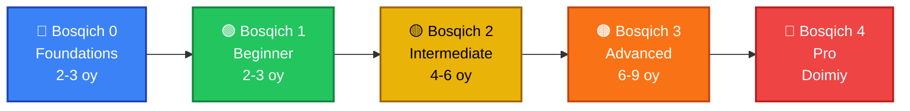

<div align="center">

# 🛡️ 0xCyberSecUz

### Noldan Proga Kiberxavfsizlik Yo'l Xaritasi

*O'zbek tilida kiberxavfsizlikni jiddiy, tizimli va amaliy asosda o'rganish uchun ochiq loyiha*


</div>

<br>

> Maqsad — nazariyani emas, **ko'nikmani** shakllantirish: har bir bosqich amaliyot, laboratoriya va real muammolar bilan mustahkamlanadi.

---

## 📚 Mundarija

- [📌 Loyiha falsafasi](#-loyiha-falsafasi)
- [🗺️ Yo'l xaritasi (5 bosqich)](#️-yol-xaritasi-5-bosqich)
- [🔵 Bosqich 0 — Foundations](#-bosqich-0--zamin-foundations)
- [🟢 Bosqich 1 — Beginner](#-bosqich-1--beginner)
- [🟡 Bosqich 2 — Intermediate](#-bosqich-2--intermediate)
- [🟠 Bosqich 3 — Advanced](#-bosqich-3--advanced-low-level-va-binary-exploitation)
- [🔴 Bosqich 4 — Pro](#-bosqich-4--pro-ixtisoslashuv)
- [🧰 CTF platformalari](#-doimiy-foydalaniladigan-ctf-va-laboratoriya-platformalari)
- [📁 Repo tuzilishi](#-repozitoriy-tuzilishi-taklif)
- [✅ Qanday boshlash kerak](#-qanday-boshlash-kerak)
- [🤝 Hissa qo'shish](#-hissa-qoshish-contributing)

---

## 📌 Loyiha falsafasi

Bu roadmap uchta printsipga asoslanadi:

| # | Printsip | Ma'nosi |
|:---:|---|---|
| 1️⃣ | **Fundament birinchi** | Tarmoq, OS va dasturlash asoslarisiz "hacking" faqat skript ishlatishga aylanadi. Avval tizimni tushunamiz, keyin sindiramiz |
| 2️⃣ | **Qo'l bilan qilish** | Har bir mavzu amaliy laboratoriya, CTF masalasi yoki mini-loyiha bilan yakunlanadi |
| 3️⃣ | **Pastdan yuqoriga** | Metasploit/Burp'dan boshlamaymiz — avval paket qanday yuriladi, protsess xotirada qanday joylashadi, syscall nima, shuni tushunamiz |

---

## 🗺️ Yo'l xaritasi (5 bosqich)



<div align="center">

| Bosqich | Nomi | Muddat | Maqsad |
|:---:|---|:---:|---|
|  | **Foundations** | 2–3 oy | Linux, tarmoq, dasturlash asoslari |
|  | **Beginner** | 2–3 oy | Xavfsizlik asoslari, birinchi CTF'lar |
|  | **Intermediate** | 4–6 oy | Web xavfsizlik, tarmoq pentesti, skriptlash |
|  | **Advanced** | 6–9 oy | Binary exploitation, reverse engineering, low-level |
|  | **Pro** | Doimiy | Ixtisoslashuv: pwn, red team, kernel, tadqiqot |

</div>

> 💡 Bosqichlar mustaqil emas — ular ustma-ust qatlamlanadi. Masalan, Linux fundamentallarini 0-bosqichda boshlaysiz, lekin 3-bosqichda kernel darajasida qaytib kelasiz.

---

<a id="-bosqich-0--zamin-foundations"></a>
## 🔵 Bosqich 0 — Zamin (Foundations)

 

<table>
<tr><td>

**🐧 Linux**
- Fayl tizimi, ruxsatlar (`chmod`/`chown`), process boshqaruvi (`ps`, `kill`, `systemd`)
- Bash skriptlash: shart operatorlari, tsikllar, matn qayta ishlash (`grep`, `sed`, `awk`)
- Arch Linux / Debian'ni qo'lda sozlash (GUI'dan qochish)
- **🎯 Amaliyot:** o'z Linux muhitingizni noldan sozlang (dotfiles, shell, tmux/vim)

</td></tr>
<tr><td>

**🌐 Tarmoq (Networking)**
- OSI va TCP/IP modeli, IP/subnetting, routing asoslari
- TCP handshake, UDP farqi, DNS, HTTP/HTTPS ishlash mexanizmi
- Asosiy tool'lar: `ip`, `ss`, `tcpdump`, `nmap`, `netcat`
- **🎯 Amaliyot:** Wireshark/tcpdump bilan trafikni tahlil qiling; socket orqali client-server yozing

</td></tr>
<tr><td>

**💻 Dasturlash**
- **C tili** — xotira modeli, pointer'lar, stack/heap farqi
- **Python** — avtomatlashtirish, pwntools/scapy uchun zamin
- *(Ixtiyoriy)* **Assembly** — x86_64 yoki ARM64

</td></tr>
</table>

📖 **Resurslar:** K&R (*The C Programming Language*) · *The Linux Programming Interface* · OverTheWire Bandit

---

<a id="-bosqich-1--beginner"></a>
## 🟢 Bosqich 1 — Beginner

 

- 🔐 **Xavfsizlik asoslari:** CIA triadasi, threat modeling, atamalar (CVE, CVSS, zero-day)
- 🔑 **Kriptografiya asoslari:** simmetrik/asimmetrik shifrlash, hashing, klassik shifrlar (Caesar, Vigenère) va ularga hujumlar
- 🏁 **Birinchi CTF tajribasi:** OverTheWire (Bandit → Narnia → Krypton), picoCTF
- 🎯 **Amaliyot loyihasi:** oddiy port scanner yozish (Python yoki C'da, raw socket bilan)

---

<a id="-bosqich-2--intermediate"></a>
## 🟡 Bosqich 2 — Intermediate

 

<details open>
<summary><b>🕸️ Web xavfsizlik</b></summary>
<br>

- OWASP Top 10: SQL injection, XSS, CSRF, SSRF, auth bypass
- Burp Suite bilan ishlash, HTTP request/response'ni qo'lda manipulyatsiya qilish
- **Laboratoriyalar:** PortSwigger Web Security Academy, DVWA, TryHackMe web yo'nalishi

</details>

<details open>
<summary><b>📡 Tarmoq pentesti</b></summary>
<br>

- Nmap chuqur skanerlash, xizmatlarni fingerprint qilish
- Active Directory asoslari (Windows muhitlarida keng tarqalgan)
- Privilege escalation texnikalari (Linux va Windows)
- **Platformalar:** TryHackMe, HackTheBox (Easy/Medium mashinalar)

</details>

<details open>
<summary><b>🐍 Skriptlash va avtomatlashtirish</b></summary>
<br>

- Python bilan exploit-dev asoslari, scapy bilan paket yasash
- O'z tool'laringizni yozish (recon skriptlari, enum skriptlari)

</details>

---

<a id="-bosqich-3--advanced-low-level-va-binary-exploitation"></a>
## 🟠 Bosqich 3 — Advanced (Low-level va Binary Exploitation)

 

> ⭐ Bu — loyihaning eng chuqur va eng qadrli qatlami, ayniqsa C/Assembly zaminiga ega bo'lganlar uchun.

<details open>
<summary><b>💥 Binary Exploitation asoslari</b></summary>
<br>

- ELF format tuzilishi, `readelf`, `objdump`, `checksec`
- Stack-based buffer overflow, shellcode yozish
- GDB + GEF bilan debugging, breakpoint strategiyalari
- **Laboratoriya:** OverTheWire Narnia, pwn.college, pwnable.kr

</details>

<details open>
<summary><b>🔍 Reverse Engineering</b></summary>
<br>

- Statik va dinamik tahlil: Ghidra, radare2/rizin, IDA (yoki bepul alternativalar)
- Anti-debugging va obfuskatsiya texnikalarini tanish
- **Amaliyot:** crackme'larni yechish (crackmes.one)

</details>

<details open>
<summary><b>🛡️ Zamonaviy himoya mexanizmlarini yengish</b></summary>
<br>

- ASLR, NX/DEP, stack canary, PIE — ishlash prinsipi va bypass strategiyasi
- ROP (Return-Oriented Programming) zanjirlari qurish
- Format string zaifliklari, heap exploitation (use-after-free, double-free)
- **Vositalar:** pwntools, ROPgadget

</details>

<details open>
<summary><b>⚙️ Arxitektura chuqurligi (x86_64 va ARM64)</b></summary>
<br>

- Registrlar, calling convention (System V ABI / AAPCS64), syscall konvensiyalari
- C + Assembly aralash loyihalar: `clang main.c asm.s -o prog`
- Emulyatsiya: Unicorn engine bilan kod bajarilishini tahlil qilish

</details>

📖 **Tayanch kitoblar:** *Hacking: The Art of Exploitation* · *CS:APP* · *Expert C Programming*

---

<a id="-bosqich-4--pro-ixtisoslashuv"></a>
## 🔴 Bosqich 4 — Pro (Ixtisoslashuv)

 

Bu bosqichda tor yo'nalish tanlanadi — hammasini bir vaqtda chuqur o'rganib bo'lmaydi:

| Yo'nalish | Qamrov |
|---|---|
| 🎯 **Exploit Dev / Pwn** | Murakkab heap exploitation, kernel exploitation, fuzzing (AFL++, syzkaller) |
| 🧬 **Kernel / Driver Security** | Linux kernel moduli, rootkit tahlili, *LDD3* asosida amaliyot |
| 🕵️ **Reverse Engineering (pro)** | Malware tahlili, ICS/SCADA xavfsizligi, firmware RE |
| ⚔️ **Red Team / Offensive Sec** | OSCP darajasidagi ko'nikmalar, C2 infratuzilmasi, AD attack chain |
| 🔬 **Tadqiqot** | Yangi CVE qidirish, zero-day tadqiqoti, responsible disclosure |

> 🖥️ Bu bosqichda o'z laboratoriyangiz (masalan, cloud'dagi ARM64/x86_64 instance) muhim rol o'ynaydi.

---

## 🧰 Doimiy foydalaniladigan CTF va laboratoriya platformalari

<div align="center">

| Platforma | Yo'nalish |
|:---:|---|
| 🏴 **OverTheWire** | Linux, kriptografiya, binary exploitation (Bandit/Narnia/Krypton) |
| 🎓 **picoCTF** | Umumiy kirish darajasi, ko'p yo'nalishli |
| 🟩 **TryHackMe** | Boshlang'ichdan o'rtaga, yo'naltirilgan yo'llar |
| 📦 **HackTheBox** | O'rta-yuqori daraja, real mashinalar |
| 💣 **pwn.college** | Binary exploitation, chuqur va tizimli |
| 🔓 **pwnable.kr / crackmes.one** | Reverse engineering va pwn mashqlari |
| 🌐 **PortSwigger Web Academy** | Web xavfsizlik, bepul va eng sifatli |

</div>

---

## 📁 Repozitoriy tuzilishi (taklif)

```
0xCyberSecUz/
├── README.md                   # 📄 ushbu fayl — asosiy roadmap
├── 00-foundations/              # 🔵 Linux, tarmoq, C/Python asoslari
├── 01-beginner/                 # 🟢 xavfsizlik asoslari, birinchi CTF yechimlari
├── 02-web-security/             # 🟡 OWASP, Burp yozuvlari, writeup'lar
├── 03-network-pentest/          # 🟡 AD, privesc, tool skriptlari
├── 04-binary-exploitation/      # 🟠 pwn writeup'lari, exploit skriptlari
├── 05-reverse-engineering/      # 🟠 crackme yechimlari, tahlillar
├── 06-arm64-asm/                 # 🟠 assembly mashqlari va build workflow
├── resources.md                  # 📚 kitoblar, kurslar, havolalar ro'yxati
└── notes/                        # 📝 shaxsiy konspektlar, mavzu bo'yicha eslatmalar
```

---

## ✅ Qanday boshlash kerak

- [ ] `00-foundations` papkasidan boshlang — Linux va tarmoqni chuqur bilmasdan keyingi bosqichlarga o'tish vaqt yo'qotish bo'ladi
- [ ] Har bir mavzu bo'yicha **kamida bitta amaliy masala** yeching va uni `notes/` yoki mos papkaga writeup sifatida yozing
- [ ] Reja tuzing: haftada nechta soat ajratasiz, qaysi bosqichni qachongacha tugatishni belgilang
- [ ] Community bilan bog'laning — Discord/Telegram CTF guruhlariga qo'shiling

---

## 🤝 Hissa qo'shish (Contributing)


Bu loyiha jamoaviy rivojlanadi. Agar sizda foydali resurs, writeup yoki tuzatish bo'lsa — **pull request** oching yoki **issue** qoldiring.

<div align="center">

---

*"Kiberxavfsizlikda yorliq yo'q — faqat tizim va vaqt bor."*

⭐ Foydali bo'lsa, repога **star** bosishni unutmang!

</div>

